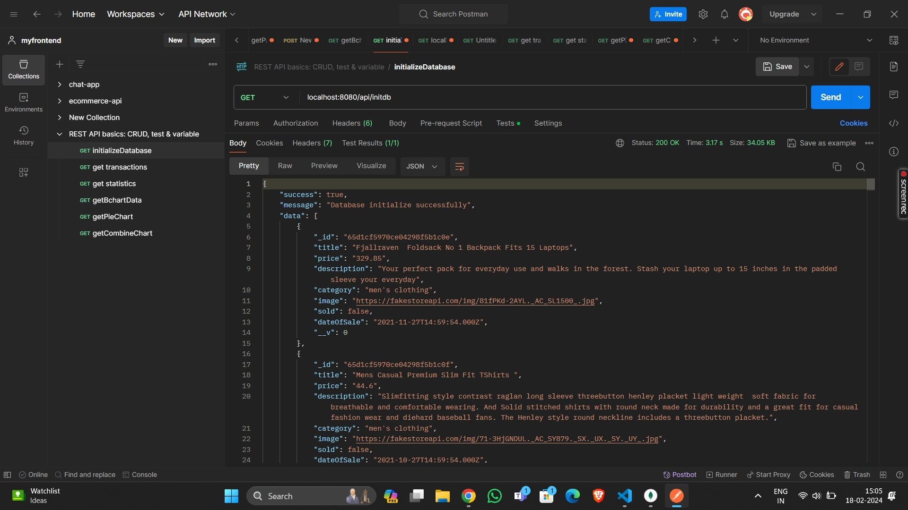
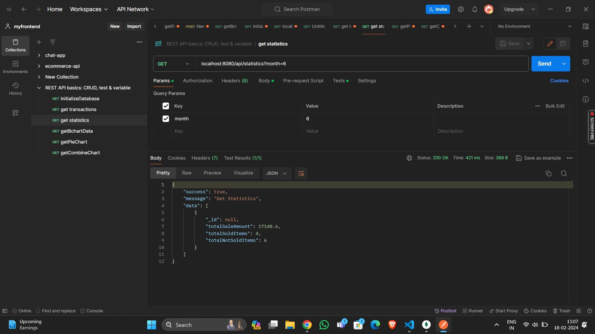
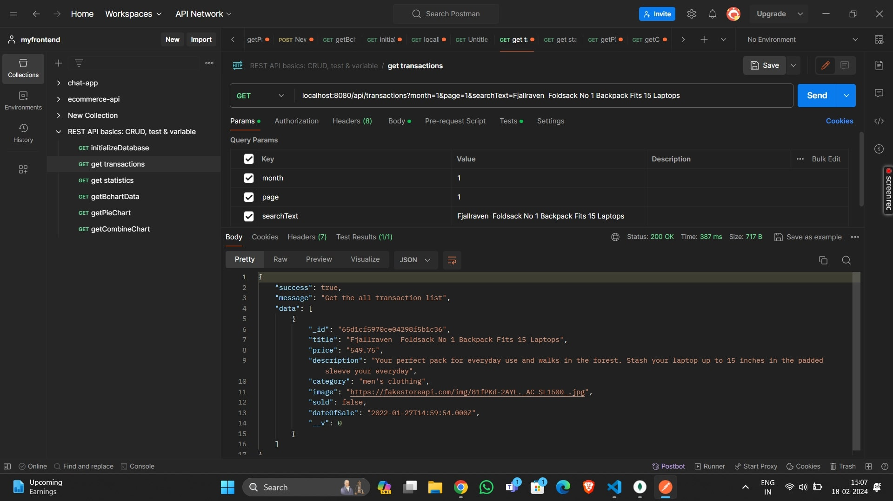
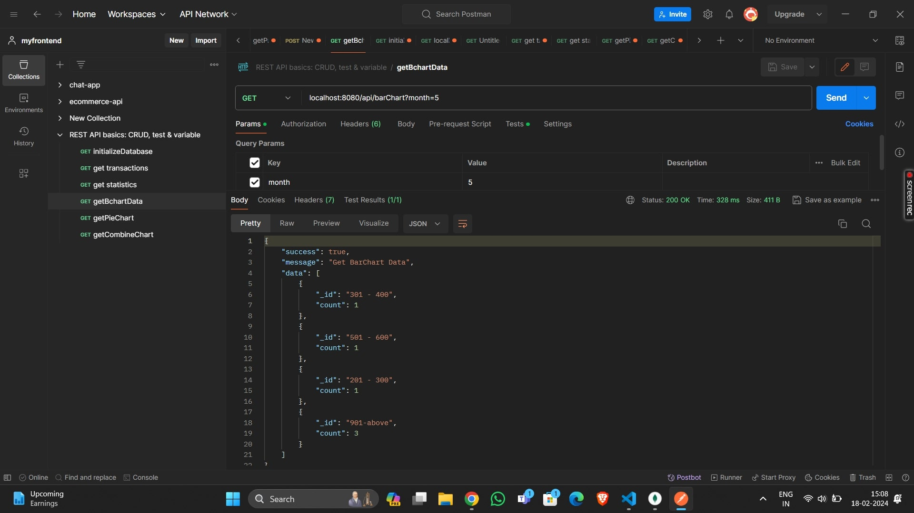
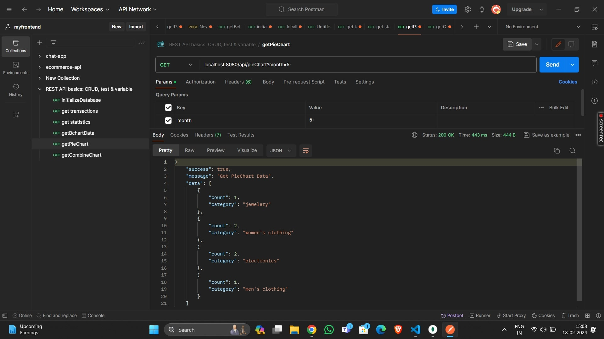
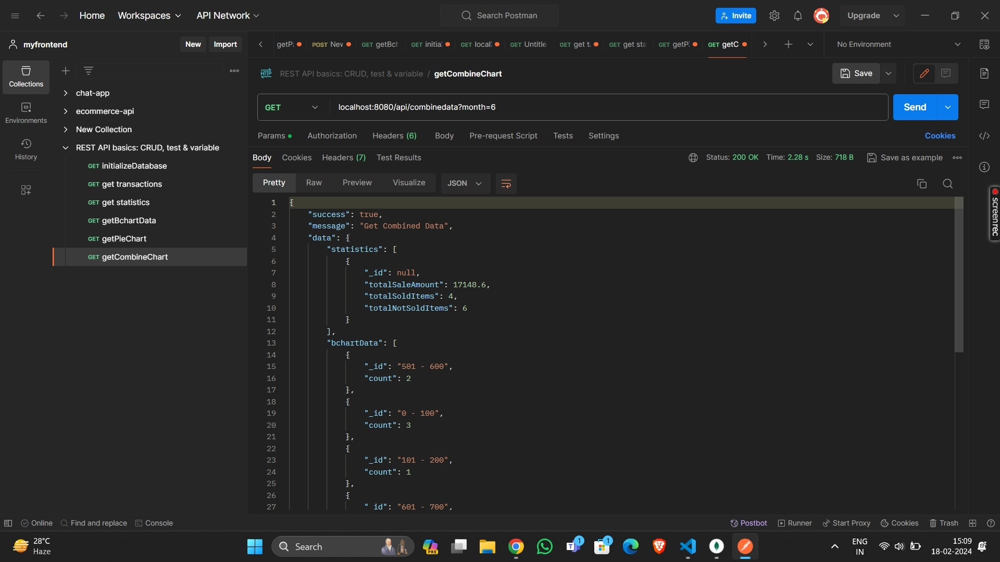

# Statistics 

## API Reference

#### URL = http://localhost:8080

## Environment Variables

To run this project locally, you will need to add the following environment variables to your .env file created in root directory of your project

- PORT
- DB_URL

## Screenshots
### Initialize the database
#### URL = "http://localhost:8080/api/initdb

 
### Statistics for specific month
#### URL = "http://localhost:8080/api/statistics?month=6"

### Transaction for specific month
#### URL = "localhost:8080/api/transactions?month=1&page=1&searchText=Fjallraven  Foldsack No 1 Backpack Fits 15 Laptops"

### Get bar chart data for specific month
#### URL = "localhost:8080/api/barChart?month=5"

### Get pie chart data for specific month
#### URL = "localhost:8080/api/pieChart?month=5 "

### Get combined  data for specific month
#### URL = "localhost:8080/api/combinedata?month=6"

